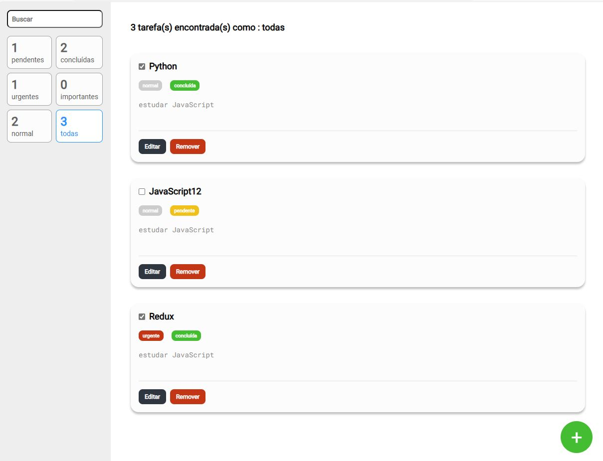

<h1>Descrição do projeto:</h1>
Lading page de lista de tarefas com diversasas funcionalidades na página como: edição, remoção e conclusão da tarefa através de botões ilustrados e correspondentes a essas atividade e com um campo de busca na parte esquerda da tela e a respectiva contagem e informções das tarefas na mesma parte esquerda (pendentes, concluídas, urgentes, importantes, normal e todas). E na parte inferior da página uma botão + que serve para adionar uma tarefa e classificando a sua prioridade: urgente, importante e normal.

Projeto desenvolvido com React. Usando a biblioteca Redux de gerenciamento de estado para aplicativos JavaScript, sendo usado em conjunto com o React. Ele fornece uma abordagem previsível para gerenciar o estado da aplicação, tornando mais fácil o controle de como os dados são compartilhados e atualizados entre os componentes.
Também foi utilizando nesse projeto a biblioteca Styled Components para estilização de componentes em aplicações React. Ele permite escrever estilos CSS diretamente nos componentes JavaScript, tornando o código mais legível, reutilizável e fácil de manter.

<h1>Visualização Online</h1>
A landing page do projeto está disponível para visualização na Vercel. Você pode acessá-la através do seguinte link:
Página com informações do Github: https://minhas-tarefas-sooty.vercel.app/

<h2>
    Pré-visualização
 </h2>

## Skills utilizadas:

 
  
  
  
  
   
  
